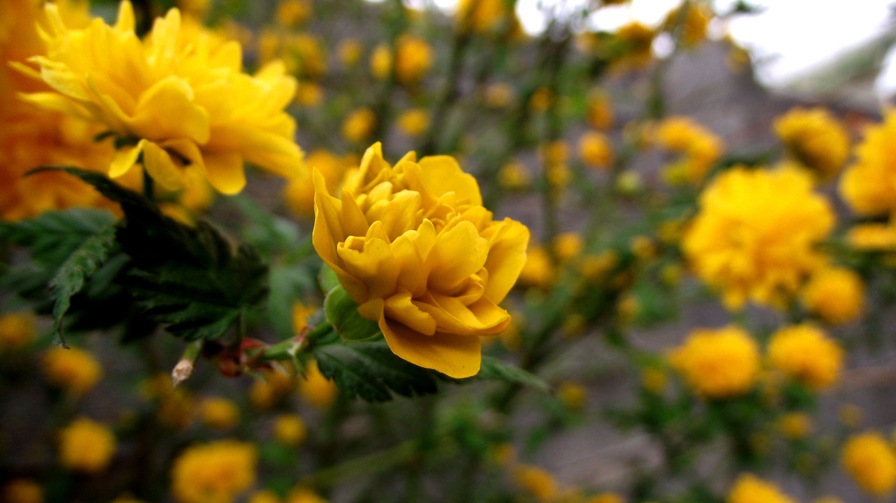
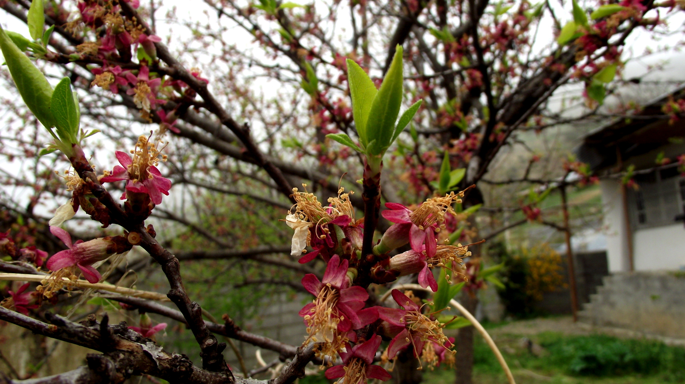

بعد حدود ۵ ماه تصمیم گرفتم که وبلاگ‌نویسی رو اینجا توی میگیم ادامه بدم و خب اگه بلاگ رو گشته باشین، احتمالا می‌دونین که من اهل مازندران هستم و عاشق طبیعت و درخت‌ها و جنگل، و هر موقع که احساس دلتنگی برای طبیعت کرده باشم و نیاز به آرامش و تفریح و زندگی داشته باشم ... تنها چند قدم با من فاصله دارن.
 
	 در فصل بهار هستیم و سوژه برای عکاسی هم فراوان، پس دست به کار شدم و چند عکس از ییلاق آبا و  اجدادی‌ام بایع‌کلأ، از نمادهای زیبای بهار یعنی شکوفه‌ها و گل‌ها عکس گرفتم: 
 

به هر گوشه از طبیعت که می‌نگرم بدون وابستگی به زمان، نکته‌ای تازه، انگیزه‌ای جدید و ایده‌ای متفاوت به من می‌دهد تا بدانم که «که هستم»، چرا هستم، کجا هستم و از کجا هستم. شاید بتوانم دیروز را انکار کنم اما خود و این زیبایی و این پیچیدگی و سادگی را چطور می‌توانم انکار کنم. 
 
چقدر می‌توانم مغرور و خودخواه باشم که خود را برتر بدانم و حق زندگی، آزادی و موجودیت طبیعت را به نام خود و برای خود مصادره کنم؟ ما چیزی را تغییر نمی‌دهیم یا خلق نمی‌کنیم ... ما تنها معامله می‌کنیم!