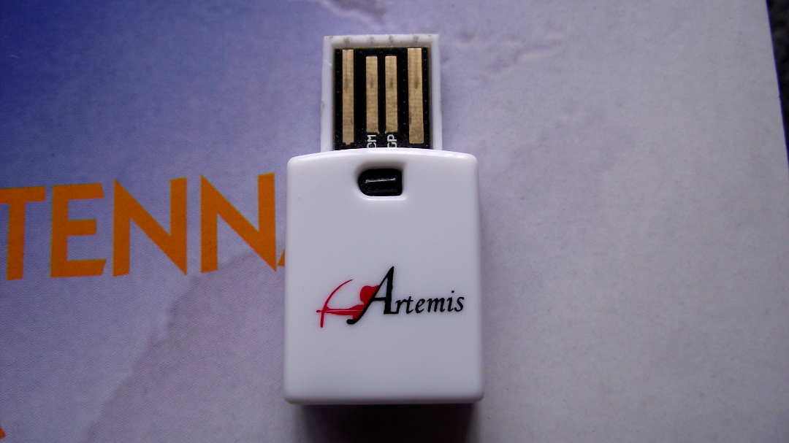
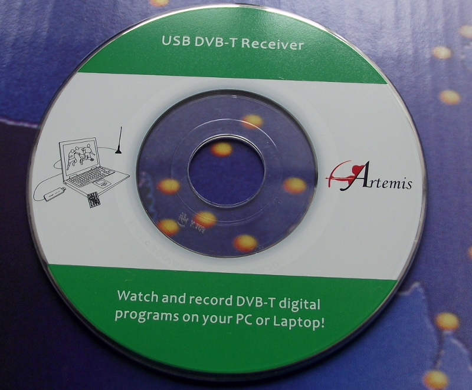
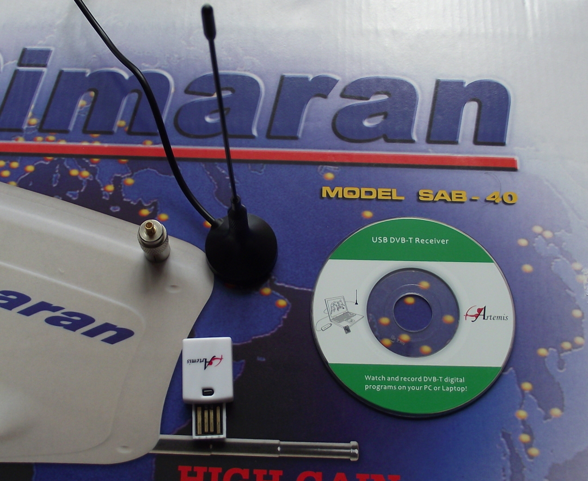
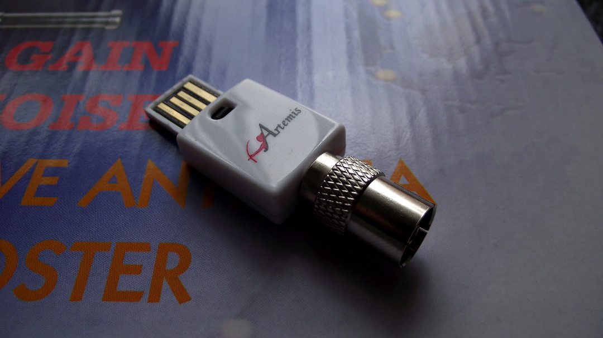
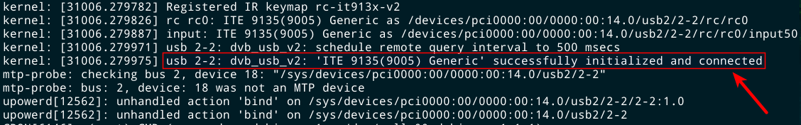
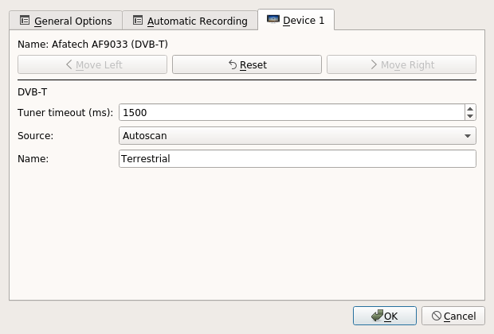
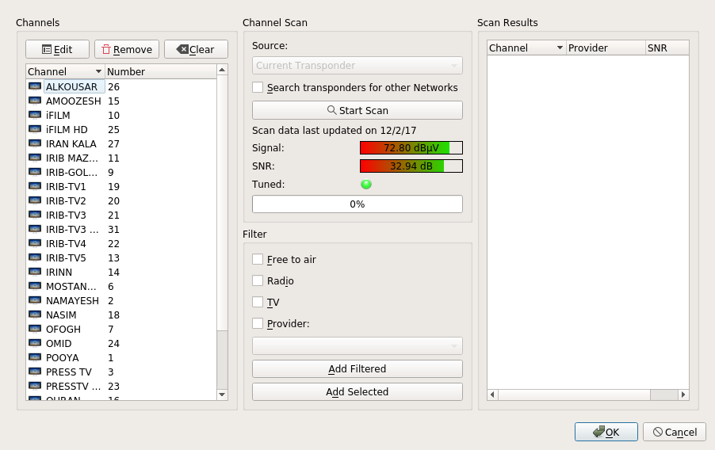
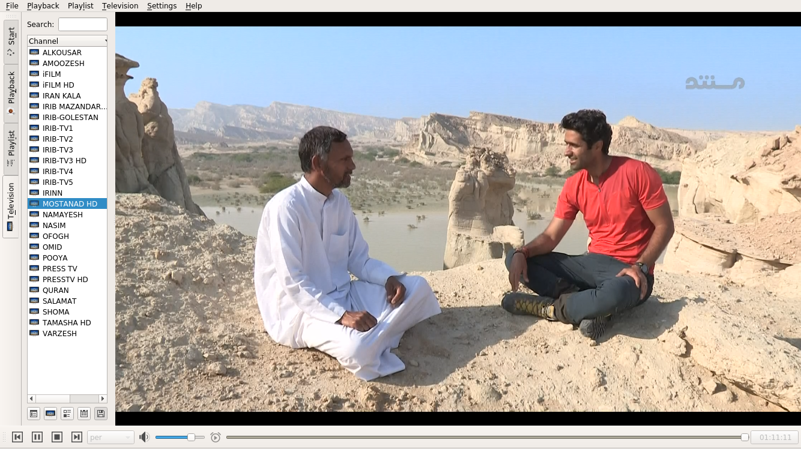

مدت‌ها بود که دنبال یک گیرنده دیجیتال بودم تا بتوانم بر روی دبیان تلویزیون نگاه کنم و برنامه‌های جالب شبکه مستند را ضبط کنم. با کلی جستجو در گوگل و فروشگاه‌های آنلاین برای کسب اطلاعات و خرید یک گیرنده دیجیتال بالاخره موفق به خرید از دیجیکالا نشدم و این محصول حالا به هر دلیلی تا زمان خرید بنده عرضه نشد، تا این که در حین گردش در بازار کامپیوتر و قطعات سخت‌افزاری موفق به خرید یک گیرنده دیجیتال یا [(DVB-T)](https://en.wikipedia.org/wiki/DVB-T)، محصول شرکت آرتمیس شدم:
 

در مدتی که در حال جستجو و مطالعه درباره‌ی گیرنده‌های دیجیتال و نصب آن‌ها بودم، اطلاعات خوب و مفیدی از نحوه نصب این دستگاه‌ها به دست آورده بودم اما با این حال هر دستگاه معمولا فرم‌ورهای و درایور خاص خود را پشتیبانی می‌کنند و به همین دلیل به نظرم آمد که کارم سخت شده، با این حال این گیرنده همراه خود سی‌دی درایور‌ها و ابزارهای خود را در بسته‌بندی داشت و معمولا شرکت‌ها از ویندوز به عنوان محبوب‌ترین سیستم‌عامل پشتیبانی می‌کنند اما در کمال تعجب دیدم که دایرکتوری لینوکس در محتویات این سی‌دی وجود داشت که در آن کد منبع درایور و همینطور فرم‌ور این گیرنده وجود داشت و نیاز به کامپایل داشت:
 

اما نگران نباشید، نام سخت‌افزار این گیرنده [ITE9135 ](https://www.linuxtv.org/wiki/index.php/ITE_IT9135) می‌باشد و فرم‌ور مورد نیاز آن در بسته‌ی [firmware-misc-nonfree ](https://packages.debian.org/jessie-backports/firmware-misc-nonfree) می‌باشد که با اجرای دستور زیر می‌توانید آن را نصب کنید :

<code style="display: block; direction: ltr">
sudo apt install firmware-misc-nonfree
</code>

و همانطور که می‌بینید، این بسته جزوی از مخزن غیر آزاد یا nonfree در مخازن دبیان است و شما می‌بایست در فایل /etc/source.list خود این [کامپوننت](https://wiki.debian.org/SourcesList)  را اضافه کنید و
پس از نصب سیستم خود را برای بارگذاری فرم‌ورها ری‌استارت کنید.

در کنار دستگاه گیرنده، محتوایت دیگر از جمله آنتن همراه و کنترل از راه دور که در عکس نیست و به همراه یک مبدل سیم [کواکسیال](https://fa.wikipedia.org/wiki/%DA%A9%D8%A7%D8%A8%D9%84_%DA%A9%D9%88%D8%A7%DA%A9%D8%B3%DB%8C%D8%A7%D9%84) وجود داشت:
 

در تهران یا شهرهایی چون مشهد شاید، اما در مازندران نمی‌شود از آنتن کوچک همراه دستگاه استفاده کرد چرا که سیگنال آنتن‌های فرستنده آنچنان قدرتمند نیست و به همین دلیل آنتنی هوایی باید خرید و من هم آنتن سیماران را انتخاب کردم چرا که ابزارهای مورد نیاز از جمله بوستر تقویت کننده سیگنال را هم به همراه داشت:
 

پس از نصب آنتن هوایی و اتصال سیم‌ها به بوستر و نصب فیش سیم کواکسیال به مبدل گیرنده دیجیتال، کارهای سخت‌افزاری‌ام به پایان رسید. حال برای تایید درستی کارکرد گیرنده دیجیتال و قبل از اتصال usb به پورت سیستم خود می‌توانید با اجرای دستور زیر از اتصال موفقیت آمیز گیرنده و شناسایی آن توسط دستگاه مطمئن شوید:

<code style="display: block; direction: ltr">
sudo tail -f /var/log/syslog
</code>

حال با اتصال گیرنده به پورت usb، متوجه پیامی در خروجی ترمینال خود می‌شوید:
 

در این مرحله نیاز به نصب یک کلاینت داریم تا بتوانیم شبکه‌ها را جست‌جو کرده و لیست کانال‌های تلویزیونی را ذخیره و برنامه‌ها را مشاهده کنیم. برای جستجو یا لیست کردن ابزار‌های تحت ترمینال وجود دارد و همینطور برنامه‌های گرافیکی مختلف اما انتخاب من برنامه‌ی کافئین ( [Kaffeine](https://packages.debian.org/stretch/kaffeine) ) هست.
 

<code style="display: block; direction: ltr">
sudo apt install kaffeine
</code>

پس از نصب برنامه را اجرا کنید و به مسیر زیر در منوی اصلی بالای برنامه بروید:
 

<code style="display: block; direction: ltr">
Television > Configure Television ... > Device 1
</code>

سپس به شکل زیر می‌توانیم تنظیم کنید:
 

و بر روی دکمه ok کلیک کنید. حال وقت آن رسیده که برای جست‌و‌جوی کانال‌ها اقدام کنیم و باید به مسیر زیر رفت:
 

<code style="display: block; direction: ltr">
Television > Channels
</code>

 

حال بر روی دکمه Start Scan کلیک کنید تا کانال‌های تلویزیونی را جست‌جو کند اما در عکس بالا می‌بینید که من اسکن کردم و لیست کانال‌ها را شخصی‌سازی کرده و ذخیره کردم. حال کار ما تمام شده و با کلیک بر روی اسم کانال‌ها این شبکه‌های تلویزیونی را به صورت یک جریان زنده بر روی سیستم لینوکس خود تماشا کنید :
 

در این قسمت هم برای مطالعه و یا جست‌جوی بیشتر لینک‌های مشابه از وبلاگ‌های دیگر دوستان گیکی و ویکی‌های لینوکس قرار می‌دهم تا هم تشکری به تلاش دوستان عزیز باشد و هم کمک افزایش دانش خواننده علاقمند بلاگم:
 

مطالب مشابه دوستان گیکی:
* [ ده گام تا راه اندازی گیرنده دیجیتالی ایکس‌ویژن ... |  گیک آزاد
](http://freegeek.ir/1393/03/setup-xvision4100-dvbt-on-gnu-linux/)
* [تماشای تلویزیون با استاندارد DVB-T در لینوکس](https://jalil.me/posts/8/%D8%AA%D9%85%D8%A7%D8%B4%D8%A7%DB%8C-%D8%AA%D9%84%D9%88%DB%8C%D8%B2%DB%8C%D9%88%D9%86-%D8%A8%D8%A7-%D8%A7%D8%B3%D8%AA%D8%A7%D9%86%D8%AF%D8%A7%D8%B1%D8%AF-DVB-T-%D8%AF%D8%B1-%D9%84%DB%8C%D9%86%D9%88%DA%A9%D8%B3)

منابع ویکی‌های لینوکس:

* [ویکی دبیان](https://wiki.debian.org/USB-DVBT%20Stick?highlight=%28dvb%29)
* [ویکی جنتو](https://wiki.gentoo.org/wiki/TV_Tuner)
* [ویکی آرچ](https://wiki.archlinux.org/index.php/DVB-T)

در پایان هم خیلی علاقه‌مند هستم تا نظرات و بازخوردهای شما خواننده‌های عزیز را در مورد این مطلب و چه اصلاح یا چه در مورد کمکی که بهتون در حل مشکلی کرد بدانم پس از این به بعد را شما شروع کنین: