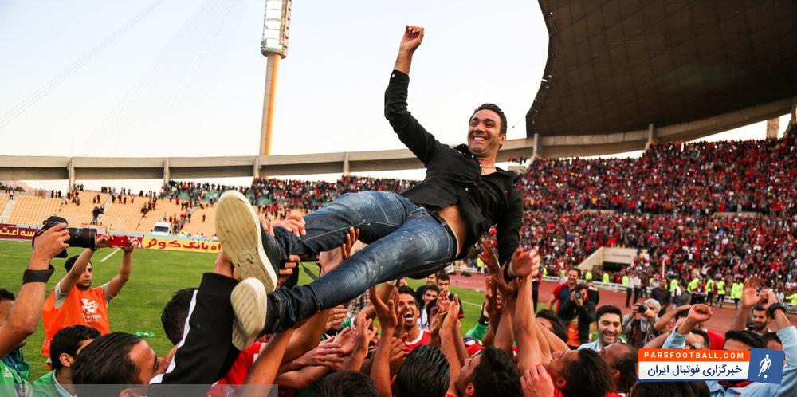

بعد از یک هفته جشن و شادی و آنالیز می‌خوام یادی کنم از سال‌هایی که اسم و ورزشگاه و بازی‌های نساجی برام خاطره ساختن و این که چقدر دنبال کردن این تیم در اون سال‌ها برام خسته کننده بود.

شهر [قائمشهر](https://fa.wikipedia.org/wiki/%D9%82%D8%A7%D8%A6%D9%85%D8%B4%D9%87%D8%B1) که با نام قدیمی و محبوبش، «شاهی» شناخته میشه زادگاه تیم محبوب و قدیمی نساجی هست که به شکلی تیم تبلیغاتی شرکت نساجی قائمشهر به حساب می‌آمد. شاید بشه گفت یکی از دلایلی که من از کودکی علاقه به فوتبال پیدا کردم به خاطر بستر فوتبالی محیط و منطقه زندگی من بود، یعنی علاقه وافری به فوتبال در قائمشهر وجود داره با در نظر گرفتن این که این ورزش در کل جهان علاقه‌مندهای بسیاری داره و در کل ایران اما اینجا مثال برزیل و برزیلی بودن هست یه جورایی « :)) ».

شاید جالب باشه که من اولین بار که فوتبال بازی می‌کردم و تا سال‌ها اصلا نمی‌دونستم نساجی چی هست و اینا چی هستن. تنها چیزی که بلد بودم این بود که[ رئال‌مادرید](https://fa.wikipedia.org/wiki/%D8%A8%D8%A7%D8%B4%DA%AF%D8%A7%D9%87_%D9%81%D9%88%D8%AA%D8%A8%D8%A7%D9%84_%D8%B1%D8%A6%D8%A7%D9%84_%D9%85%D8%A7%D8%AF%D8%B1%DB%8C%D8%AF) و[ زیدان](https://fa.wikipedia.org/wiki/%D8%B2%DB%8C%D9%86%E2%80%8C%D8%A7%D9%84%D8%AF%DB%8C%D9%86_%D8%B2%DB%8C%D8%AF%D8%A7%D9%86) انگیزه‌های فوتبالی من بودن و عاشق بازی‌هاشون بودم و اما از زمانی که اسم[ نادر دست‌نشان](https://fa.wikipedia.org/wiki/%D9%86%D8%A7%D8%AF%D8%B1_%D8%AF%D8%B3%D8%AA%E2%80%8C%D9%86%D8%B4%D8%A7%D9%86) رو شنیدم و دیدمش،‌ با نساجی آشنا شدم که بر می‌گرده به سال ۱۳۸۸. مربی‌ای که تمام دوران بازیگری خودش رو در نساجی بود.

 شاید اینطور میشه گفت که من حدود ۹ سال هست که طرفدار نساجی هستم و انگیزه‌ای جز خود فوتبال و تعصب تیم شهرم، منو طرفدار این باشگاه نگه نداشت. البته قابل اعتراف هست که چندین سال قبل از دست‌نشان هم برای دیدن بازی‌های نساجی می‌رفتم ولی واقعیت این بود که اصلا متوجه نبودم که نساجی چی هست و قضیه‌ی نساجی از کجا آب می‌خوره. 
 
>  قضیه این خستگی از این جا نشأت می‌گیره که نساجی هر سال تا لبه صعود به لیگ برتر پیش می‌رفت و هر بار به صورت بسیار بسیار عجیب و دلسرد کننده‌ای موفق نمی‌شد و این هر سال تکرار می‌شد تا جایی که من از پی‌گیری نتایج نساجی به کلی خسته‌شدم و رها کردم تا میانه این فصل که تیم خیلی سر و صدا کرد و بازی‌های بسیار زیبایی از خودش نشون داد و واقعا سرگرم‌کننده و زیبا بودن.
 
 شاید کمتر کسی باشه که علاقه به فوتبال داشته باشه و بتونه به نساجی بی‌اعتنا باشه چرا که این تیم یک فرهنگ و زندگی هست تا این که فقط ورزشی و فوتبالی باشه. خیلی از مردم قائمشهر و بیشتر مازندرانی‌ها با نساجی بزرگ شدن و جوانی و شور و علاقه خودشون رو با این تیم شریک شدن و در آخر امید چند دهه‌ای این انسان‌های علاقه‌مند، ناامید نشد.
 
 